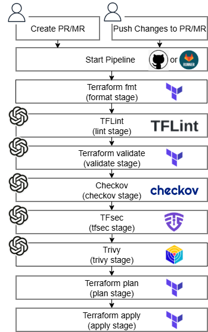
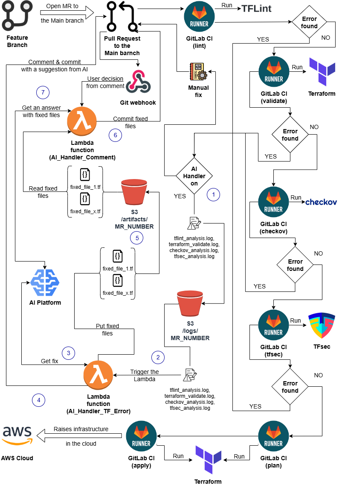

# BrainTF Project

> **Disclaimer!** *When using our solution to review your IaC and application code with any external or internal AI platform, we strongly recommend paying particular attention to your responsibility for securing confidential data.*
> *We do not store confidential data and cannot guarantee that the information you provide when using such platforms will remain confidential. Furthermore, we are not responsible for interactions between our solution and any platform, and all potential risks are solely the user's.*
> *Always ensure that all the code and data you share do not contain any confidential or sensitive information. Disclosed data should be de-identified or otherwise prepared in compliance with all data protection requirements. Be informed and clearly understand that you only share data that can be safely disclosed.*
> *By confirming the use of our solution, you agree to take full responsibility for any potential risks associated with revealing your data.*

The BrainTF is AI-powered tool for automatically finding and fixing linting, validation, and security analysis errors in Terraform code. It ensures rigorous validation, testing, and security of the code before applying it to a real environment.
### Diagram

The process includes the following stages:

* **Create PR/MR (Pull Request / Merge Request)**: A developer creates a  PR/MR request, depending on the VCS, to make changes to the infrastructure code.
* **Push Changes to PR/MR**: After creating the PR/MR, code changes are pushed to the repository (e.g., GitHub or GitLab).
* **Start Pipeline**: The pipeline is automatically triggered upon committing changes to the PR/MR.
* **Format Stage (Terraform fmt)**: The code is automatically checked for formatting according to Terraform standards.
* **Lint Stage (TFLint)**: The Terraform code is checked for style and syntax issues using TFLint.
* **Validate Stage (Terraform validate)**: The Terraform code is validated for correctness.
* **Checkov Stage**: Security vulnerabilities and potential issues in the code are analyzed using Checkov.
* **TFsec Stage**: Additional security analysis is performed using TFsec.
* **Trivy Stage**: Containers and dependencies are scanned for vulnerabilities using Trivy. This stage will be added in the next release!
* **Plan Stage (Terraform plan)**: A plan of changes to be applied to the infrastructure is created.
* **Apply Stage (Terraform apply)**: The changes are applied to the infrastructure.

### Detailed Diagram

## Workflow

### Project Description According to the Diagram

The project represents an automated process for code verification and correction using a CI/CD pipeline, AWS Lambda functions, S3 storage, and an AI platform. The main goal is to automate code review and fix errors using AI, integrating these changes into the main repository branch.

---

### Details for infrastructure parts:

#### **I1:** AI Handler on
- Checks whether the AI-based handler (AI Handler) is enabled. If enabled, the process of analyzing and fixing errors using AI begins. If disabled, the fixes are performed manually.

#### **I2:** Logs in S3
- Analysis logs (e.g., `tflint_analysis.log`, `terraform_validate.log`, etc.) are stored in S3 storage with an identifier, MR_NUMBER (Merge Request number).

#### **I3:** AI Platform
- The AI platform is used to analyze errors and generate suggestions for fixing them. AI processes requests and returns the corrected code.

#### **I4:** Lambda Function (AI_Handler_TF_Error)
- The Lambda function initiates the process of analyzing errors in Terraform (or other tools), sending requests to the AI platform and saving the results.

#### **I5:** S3 /artifacts/
- Corrected files (e.g., `fixed_file_1.tf`, `fixed_file_x.tf`) are stored in S3 storage in the `/artifacts/` directory with the identifier MR_NUMBER.

#### **I6:** DynamoDB
- DynamoDB is used to store request history (Get/Put requests). This allows tracking of changes and results from the AI processing.

#### **I7:** Lambda Function (AI_Handler_Comment)
- The Lambda function processes comments from the Pull Request. After analysis, AI adds comments with suggestions for corrections or automatically fixes the code.

#### **I8:** Pull Request and Comments
- A Pull Request to the main branch is the starting point of the process. AI analyzes the comments, and the user can accept or reject the suggested code fixes.

---

### Details for CI/CD Stages:
#### **P1:** terraform fmt
- Code formatting check. If errors are found, the process stops. The further checks will not proceed until the entire code is manually formatted locally with `terraform -fmt -recursive` and re-pushed.

#### **P2:** lint
- Code analysis using a linter (`TFLint`). If errors are found, the process stops. Further stages will not proceed until the user fixes the errors manually or approves the AI-corrected files.

#### **P3:** validate
- Validation of Terraform configurations. If errors are found, the process stops. Further stages will not proceed until the user fixes the errors manually or approves the AI-corrected files.

#### **P4:** checkov
- Code analysis using Checkov (infrastructure security analysis). If errors are found, the process stops. Further stages will not proceed until the user fixes the errors manually or approves the AI-corrected files.

#### **P5:** tfsec
- Security analysis of Terraform code using `tfsec`. If errors are found, the process stops. Further stages will not proceed until the user fixes the errors manually or approves the AI-corrected files.

#### **P6:** trivy
- Vulnerability scanning using `trivy`. If errors are found, the process stops. Further stages will not proceed until the user fixes the errors manually or approves the AI-corrected files. This stage will be added in the next release!

#### **P7:**plan
- Terraform plan generation. At this stage, Terraform verifies the infrastructure's deployability and creates a file with a list of objects to be deployed/modified/deleted for transfer to the next stage, where they will be deployed. This stage will not begin until the user manually fixes errors or approves files fixed by the AI in all previous stages. Currently, only the first directory specified in the 'WORK_DIRS' variable is processed! This limitation may be revised in future releases!

#### **P8:** apply
- Applying changes to the infrastructure. This stage is only triggered after all previous checks are successfully passed. Currently, only the first directory specified in the 'WORK_DIRS' variable is processed! This limitation may be revised in future releases!

## Bot usage guidance
This Bot supports next structured comment commands to trigger automation:
* **"bot approve"** or **"bot approve all"** - triggers the approval of committing all files fixed by AI bot.
* **"bot approve <path/to/file1> [<path/to/file2> ...]"** - triggers the approval of committing a specific file or files fixed by AI bot.
* **"bot list"** - lists files correted by AI and ready to commit.
* **"bot prompt <user prompt>"** - sends custom prompt to AI.
* **"help"** - shows this help information in the MR/PR notes.

## Guides and Instructions

* [Installation and configuration processes](docs/installation.md)
* [BrainTF Demo Scenario](docs/demo_guide.md)
