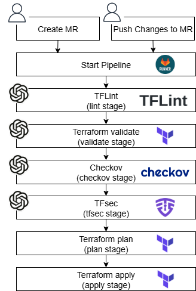
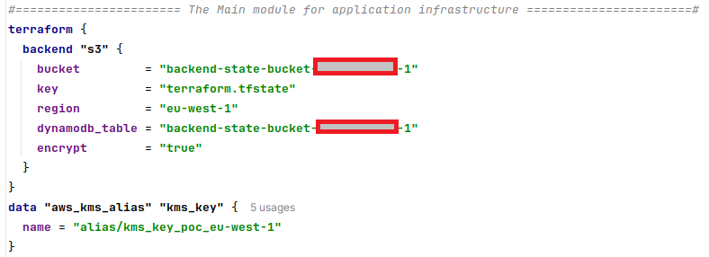

# AI tools for remediation and security analysis of Terraform code
<hr>

> **Disclaimer!** *When using our solution to review your IaC and application code with any external or internal AI platform, we strongly recommend paying particular attention to your responsibility for securing confidential data.*
> *We do not store confidential data and cannot guarantee that the information you provide when using such platforms will remain confidential. Furthermore, we are not responsible for interactions between our solution and any platform, and all potential risks are solely the user's.*
> *Always ensure that all the code and data you share do not contain any confidential or sensitive information. Disclosed data should be de-identified or otherwise prepared in compliance with all data protection requirements. Be informed and clearly understand that you only share data that can be safely disclosed.*
> *By confirming the use of our solution, you agree to take full responsibility for any potential risks associated with revealing your data.*

## Prerequisites for installing AI tools
### Diagram

1. Enter all directories with Terraform code that will be checked into the WORK_DIRS variable. It is necessary to take into account that the pipeline can only process code located within the repository with tools.
2. To start working with AI Tools, you need to set up a GitLab CI pipeline with the necessary tools that will provide log files with errors found and warnings. To do this, you need to fill in [.gitlab-ci.yml](.gitlab-ci.yml) with the correct values of the Boolean variables opposite the tools used.
3. Specify the versions of the tools used.
4. Fill in the Common variables and raise the infrastructure using the Terraform code, which will be discussed below.


## Terraform Issue AI Handler

**Purpose:** Terraform AI Handler is a tool for automatically applying fixes to errors and warnings received from TFLint, Terraform validate, Checkov, TFSec.

### Diagram


## Workflow

1. If the boolean variable AI_HANDLER_CREATE is set to TRUE, and one or all stages (lint, validate, checkov, tfsec) are enabled, the logs with their errors are placed in a versioned bucket for artifacts in a subfolder with the merge request number in the logs folder and remain there until processed by the Lambda or overwritten by the next iteration of checks.
2. The appearance of a new version of the logs triggers the Lambda (AI_Handler_TF_Error).
3. The Lambda (AI_Handler_TF_Error) reads metadata from the log files and their content, sending them to the AI for processing, adding the necessary prompt with the task.
4. The Lambda (AI_Handler_TF_Error) returns the corrected version of the files along with a comment to the MR notes.
5. The corrected files are moved to a subfolder with the merge request number in the *artifacts* folder.
6. Using the second Lambda (AI_Handler_Comment), the user agrees that the files are correctly fixed with the appropriate command (bot approve * or bot approve all) in the MR notes. The file/files are committed to the MR through a new commit by the bot account, which triggers a cycle of re-checking by the linter and Terraform validation (depending on the selected options).
7. Optionally, the user can ask a question directly to the AI through the Lambda (AI_Handler_Comment).

## Installation and integration process
### State bucket creation

1. Copy the [terraform.tfvars](docs/config_files/bootstrap/terraform.tfvars) into the [state_bucket/](terraform/state_bucket) directory and fill it with the correct variables.
2. Run `terraform init` command in [state_bucket/](terraform/state_bucket) directory.
3. Run `terraform plan/apply` commands in [state_bucket/](terraform/state_bucket) directory.
4. After this, the necessary variables will be automatically added to the beginning of the files: [main_module/main.tf](terraform/main_module/main.tf) and [main_module/terraform.tfvars](terraform/main_module/terraform.tfvars).

*main_module/main.tf*

*main_module/terraform.tfvars*


#### Necessary environment variables for *state_bucket* modules

Define all block variables in `terraform/state_bucket/terraform.tfvars` file:
<details><summary>...</summary>

``` hcl
# Tag block
environment              = "Production"               # Environment name (e.g., Production, Staging, Development)
team                     = "DevOps"                   # Team responsible for the infrastructure
deployed_by              = "Terraform"                # Tool for deploying the infrastructure
owner_mail               = "devops@example.com"       # Email address of the infrastructure owner

# Block of common variables
account_id               = "<my_account_id>"          # AWS account ID
region                   = "<my_region>"              # AWS region where resources will be deployed
project_name             = "<my_project>"             # Name of the project
```

 </details>

### GitLab CI Integration and Infrastructure Elements Setup
1. Copy the [terraform.tfvars](docs/config_files/main_module/terraform.tfvars) and the [secrets.auto.tfvars](docs/config_files/main_module/secrets.auto.tfvars) into the [main_module/](terraform/main_module) directory and fill it with the correct variables. The values of some variables will be filled in automatically after creating the state bucket in the previous step.
2. Run `terraform init` command in [main_module/](terraform/main_module) directory.
3. Run `terraform plan/apply` commands in [main_module/](terraform/main_module) directory.

#### Necessary environment variables for *main_modules* modules
Define GitLab variables and AI Handler block in `terraform/main_module/terraform.tfvars` file:
<details><summary>...</summary>

``` hcl
# Block of GitLab variables
git_hostname     = "<my_git.com>"                                     # Hostname of the GitLab instance
git_project_path = "<my_organization_name>/<my_project_name>" # Path to the GitLab project

# AI Handler block
ai_handler_create       = "false"                                     # Flag to enable or disable AI handler creation
ai_api_endpoint         = "<my_ai_api_endpoint>"                      # Endpoint for AI API
git_api_endpoint        = "<my_git_api_endpoint>"                     # GitLab API endpoint
llm_model               = "<my_llm_model_name>"                       # Name of the AI model used
oidc_provider           = "<my_oidc_provider>"                        # URL for OIDC provider (GitLab)
artifacts_bucket_prefix = "ai-handler-artifacts-bucket"               # Prefix for the name of the artifacts S3 bucket
private_subnet_ids      = ["<subnet_a>", "<subnet_b>", "<subnet_c>"]  # List of private subnet IDs for Lambda functions
security_groups         = ["<sg_a>", ...]                             # List of security groups with inbound rules for 80 and 443 ports for Lambda functions
```

 </details>

Define all tokens in `terraform/main_module/secrets.auto.tfvars` file:
<details><summary>...</summary>

``` hcl
# Secrets block (should be stored securely)
git_token = "<my_git_token>" # GitLab personal access token
ai_token  = "<my_ai_token>"  # AI API token
```
 </details>

## View and manage MR notes from GitLab

**1. AI Handler automatically attempts to fix the Terraform bug:**


**2. bot list:**


**3. bot approve <path/to/file1>:**


**4. bot prompt:**


**5. help:**


