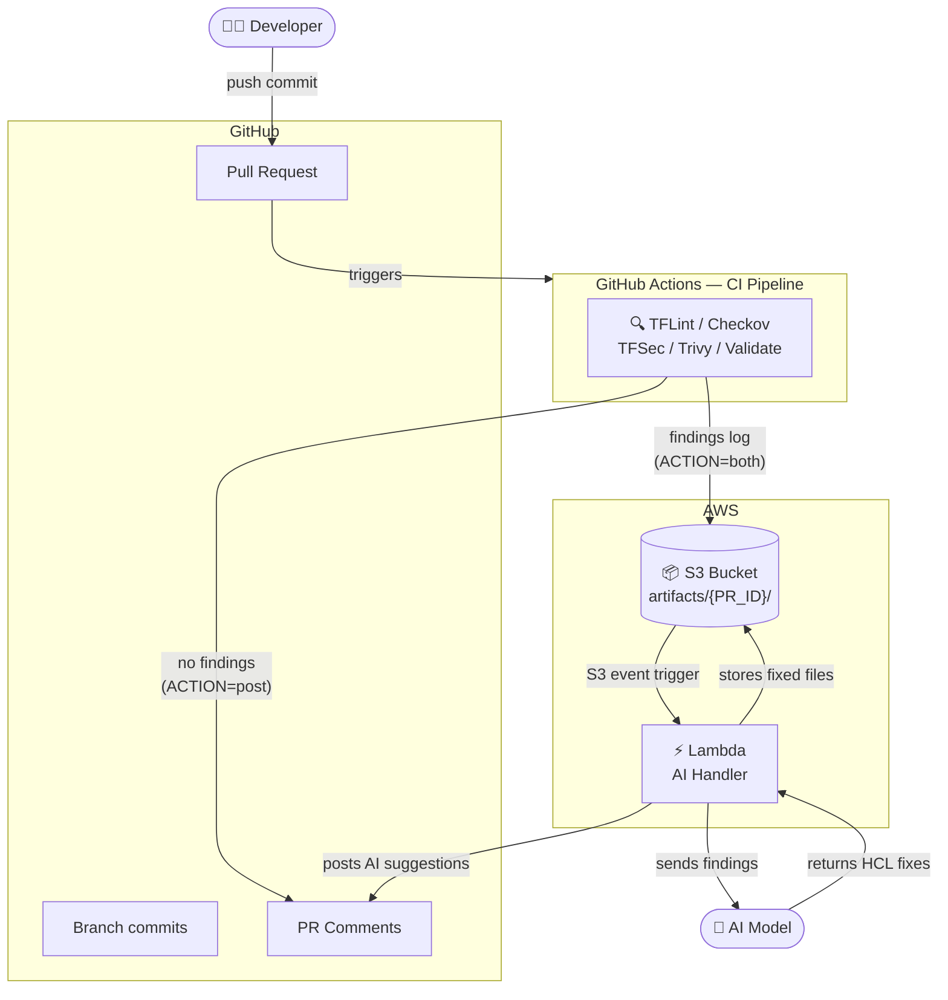
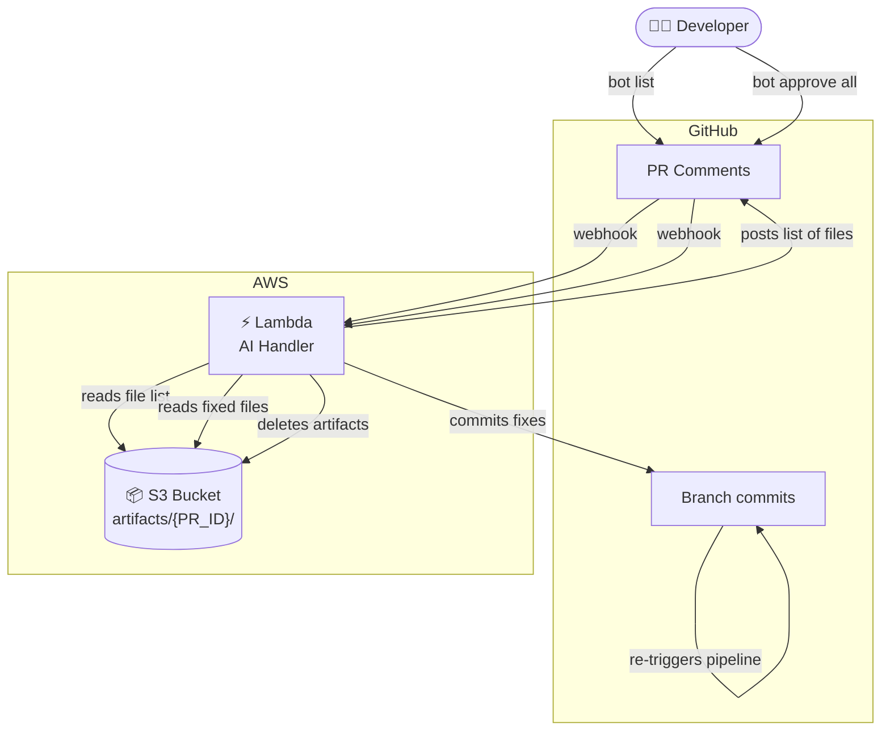

# BrainTF — How It Works

## Overall Flow

```mermaid
flowchart TD
    DEV(["👨‍💻 Developer"])

    subgraph GH["GitHub"]
        PR["Pull Request"]
        BRANCH["Branch commits"]
        COMMENTS["PR Comments"]
    end

    subgraph PIPELINE["GitHub Actions — CI Pipeline"]
        TOOLS["🔍 TFLint / Checkov\nTFSec / Trivy / Validate"]
    end

    subgraph AWS["AWS"]
        S3[("📦 S3 Bucket\nartifacts/{PR_ID}/")]
        LAMBDA["⚡ Lambda\nAI Handler"]
    end

    AIMODEL(["🤖 AI Model"])

    DEV -->|"push commit"| PR
    PR -->|"triggers"| PIPELINE
    TOOLS -->|"findings log\n(ACTION=both)"| S3
    TOOLS -->|"no findings\n(ACTION=post)"| COMMENTS
    S3 -->|"S3 event trigger"| LAMBDA
    LAMBDA -->|"sends findings"| AIMODEL
    AIMODEL -->|"returns HCL fixes"| LAMBDA
    LAMBDA -->|"stores fixed files"| S3
    LAMBDA -->|"posts AI suggestions"| COMMENTS
```

## Bot Commands Flow

```mermaid
flowchart TD
    DEV(["👨‍💻 Developer"])

    subgraph GH["GitHub"]
        COMMENTS["PR Comments"]
        BRANCH["Branch commits"]
    end

    subgraph AWS["AWS"]
        S3[("📦 S3 Bucket\nartifacts/{PR_ID}/")]
        LAMBDA["⚡ Lambda\nAI Handler"]
    end

    DEV -->|"bot list"| COMMENTS
    COMMENTS -->|"webhook"| LAMBDA
    LAMBDA -->|"reads file list"| S3
    LAMBDA -->|"posts list of files"| COMMENTS

    DEV -->|"bot approve all"| COMMENTS
    COMMENTS -->|"webhook"| LAMBDA
    LAMBDA -->|"reads fixed files"| S3
    LAMBDA -->|"commits fixes"| BRANCH
    LAMBDA -->|"deletes artifacts"| S3
    BRANCH -->|"re-triggers pipeline"| BRANCH
```
