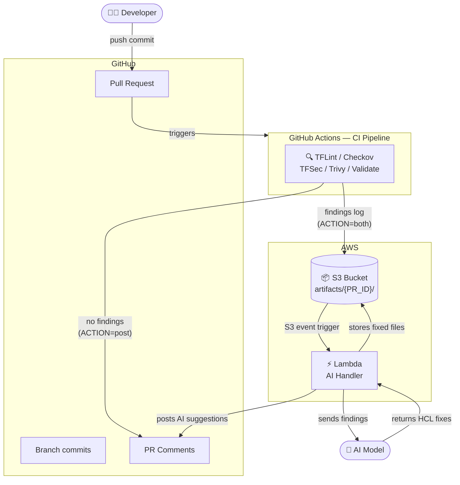
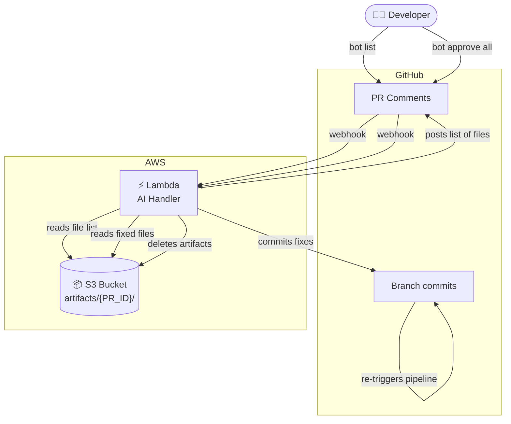

# BrainTF — How It Works

## Overall Flow

When a developer pushes a commit to a branch and opens a Pull Request, the following sequence occurs:

1. **CI Pipeline triggers** — GitHub Actions runs static analysis tools (TFLint, Checkov, TFSec, Trivy, Terraform Validate) against the Terraform code in the configured `WORK_DIRS`.
2. **Findings detected** — if any tool finds issues, the pipeline uploads a findings log to S3 under `artifacts/{PR_ID}/` and posts a notification to PR comments. The new S3 object triggers an S3 event notification.
3. **No findings** — if all tools pass, the pipeline posts a clean result directly to PR comments. No Lambda is invoked.
4. **Lambda invoked** — the S3 event triggers the AI Handler Lambda function, which reads the findings log from S3.
5. **AI processing** — Lambda sends the findings to the AI model with a fix prompt. The AI model returns corrected HCL code.
6. **Results stored and posted** — Lambda stores the fixed files back to S3 under `artifacts/{PR_ID}/` and posts AI suggestions as PR comments for the developer to review.

---

## Bot Commands Flow

After the AI Handler posts suggestions, the developer interacts with the bot via PR comments:

- **`bot list`** — Lambda reads the list of fixed files currently stored in S3 for this PR and posts the file names as a comment. Useful to confirm what the bot has prepared before approving.
- **`bot approve <file>`** — Lambda reads the specific fixed file from S3, commits it to the branch, and deletes it from S3. The new commit re-triggers the CI pipeline.
- **`bot approve all`** — same as above but for all fixed files at once. After the commit, the pipeline re-runs and the developer can verify that the fixes resolved all findings.

