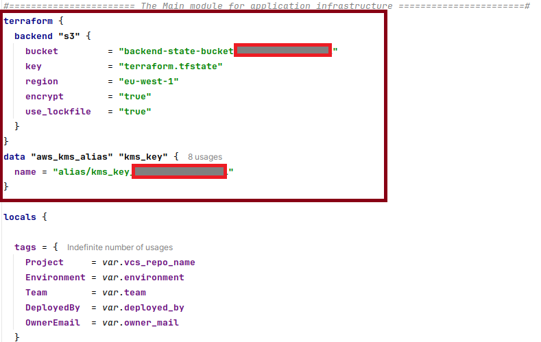
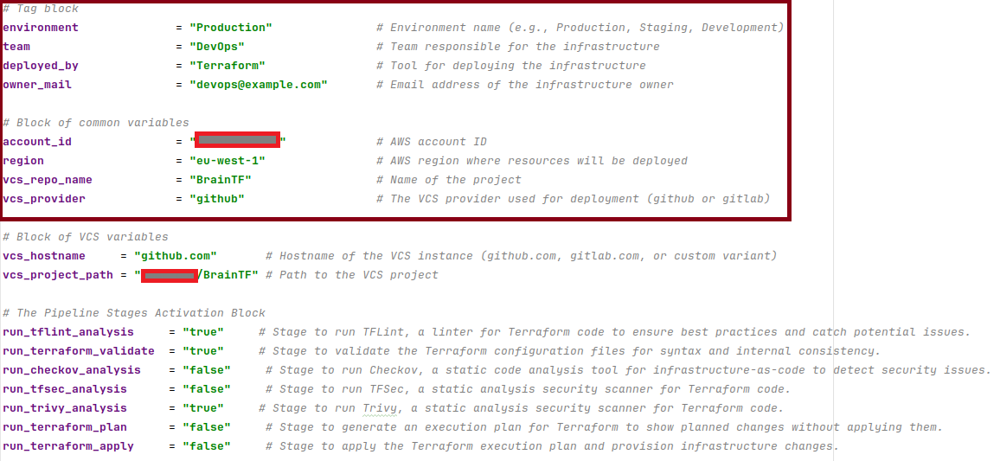
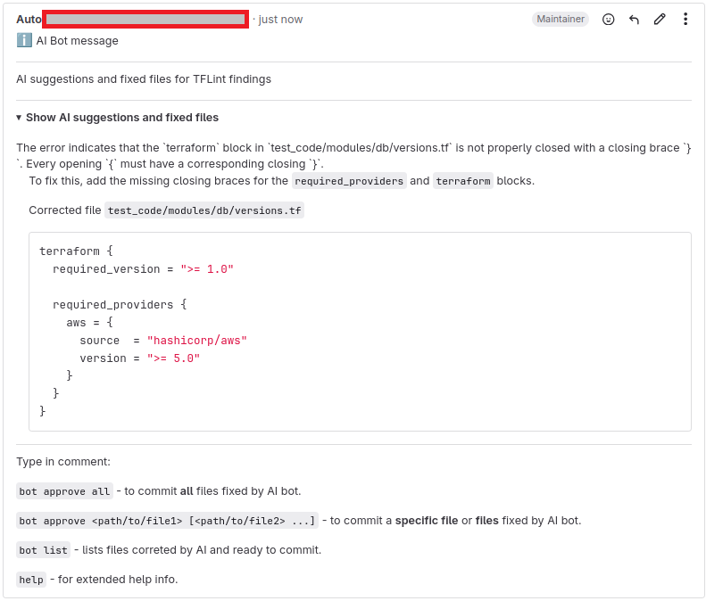
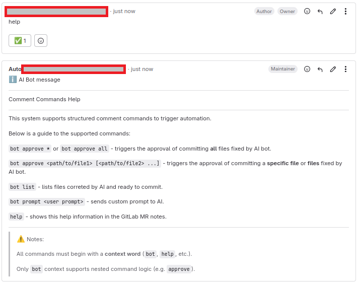
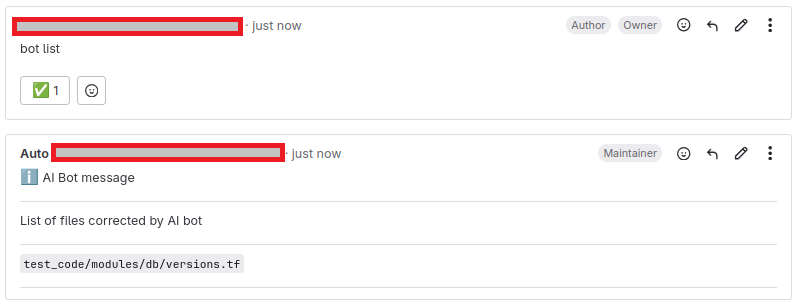
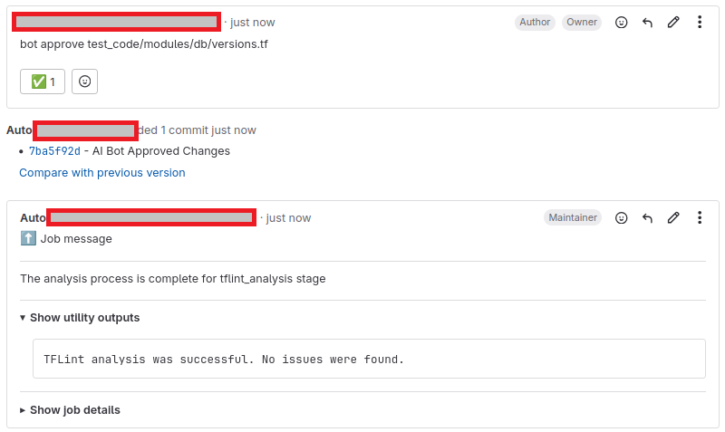
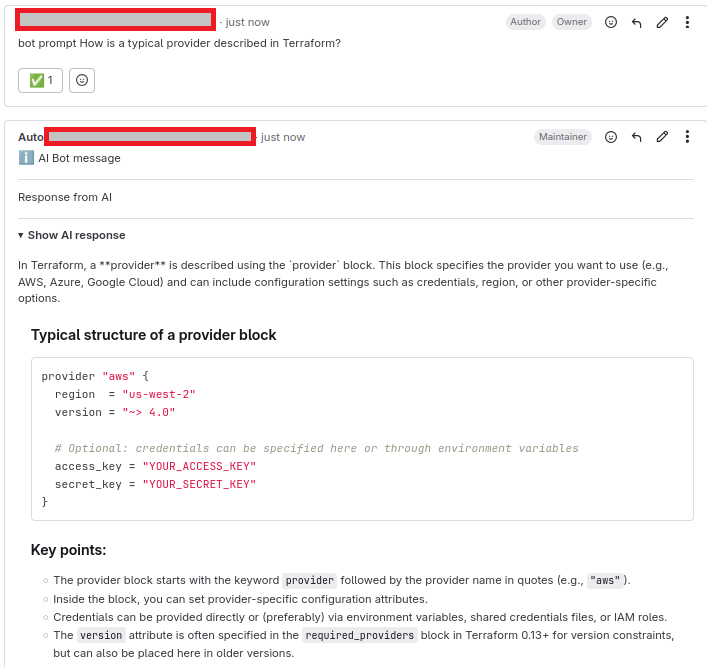
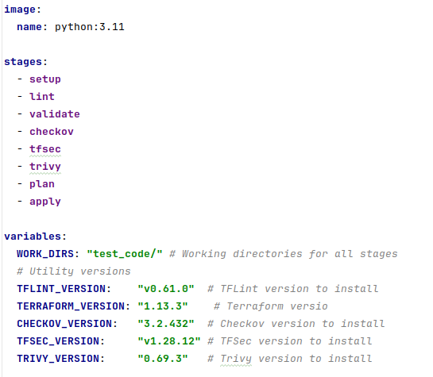
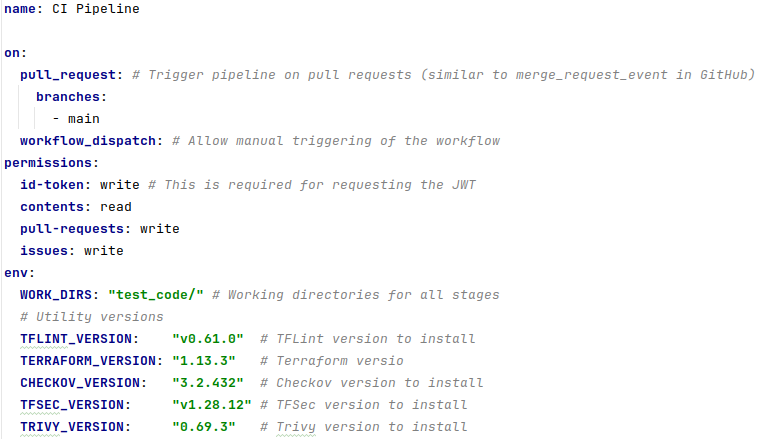

# Installation and integration process

## Overview
This document describes the process of setting up the infrastructure for the BrainTF solution using Terraform. The infrastructure consists of two main modules:
1. terraform/bootstrap: Designed for setting up the initial infrastructure, including an S3 bucket for storing the Terraform state, KMS for encryption, and IAM roles.
2. terraform/main_module: The main module that manages the rest of the infrastructure, including resource creation, integration with VCS (GitHub/GitLab), SSM parameters, Lambda functions, and other necessary components.

## Prerequisites for installing BrainTF

Before starting the installation, ensure that you have the following available and properly configured:

* AWS Account with administrator permissions.
* AWS CLI version 2 installed and configured.
* Terraform installed (recommended version >= 1.14.5).
* Access to GitHub or GitLab for VCS integration.
* Git installed for repository management (recommended version >= 2.30).
* Docker (recommended version >= 29.2.1) installed, running, and accessible.
* AWS VPC ID with private subnets (IDs) and a security group (ID) with port 443 open in ingress.

## CI/CD pipeline configuration

Workflow/pipeline described in this section can work independently and also be adopted into your workflow/pipeline to start using the tool.

1. Define a comma-separated list of directories with Terraform code in the `WORK_DIRS` variable in the corresponding pipeline file: [.gitlab-ci.yml](../.gitlab-ci.yml) or [pipeline.yml](../.github/workflows/pipeline.yml). Please note that the pipeline can only process code in the same repository as the tools.
2. The rest of the variables can be configured as part of [advanced configuration](#Advanced configuration).

## Terraform backend configuration
1. Choose an option to store Terraform state file for the `bootstrap` module using the guide [here](../docs/state_management.md).
2. Copy the [docs/config_files/bootstrap/terraform.tfvars](./config_files/bootstrap/terraform.tfvars) file into the [bootstrap/](../terraform/bootstrap) directory and replace `<placeholders>` with values for your environment.
3. Copy the [docs/config_files/main_module/terraform.tfvars](./config_files/main_module/terraform.tfvars) and [docs/config_files/main_module/secrets.auto.tfvars](../docs/config_files/main_module/secrets.auto.tfvars) files into the [main_module/](../terraform/main_module) directory. Some variables will be filled in automatically in the next steps.
4. Run `terraform init` command in `terraform/bootstrap` directory.
5. Run `terraform plan/apply` commands in `terraform/bootstrap` directory.
6. `bootstrap` deployment automatically updates [terraform/main_module/main.tf](../terraform/main_module/main.tf) and [terraform/main_module/terraform.tfvars](../terraform/main_module/terraform.tfvars) with common variables.

   

      
<b> - main_module/main.tf;</b>

      
   

   

      
<b> - main_module/terraform.tfvars</b>

      
   

## Bot deployment
1. Fill in other `<placeholders>` in [terraform/main_module/terraform.tfvars](config_files/main_module/terraform.tfvars) and [terraform/main_module/secrets.auto.tfvars](config_files/main_module/secrets.auto.tfvars) with values.
2. Run `terraform init` command in [terraform/main_module/](terraform/main_module) directory.
3. Run `terraform plan/apply` commands in [terraform/main_module/](terraform/main_module) directory.

## Post installation check

**1. Create a new MR/PR**

**2. AI Handler automatically scans the Terraform code in the repo and attempts to fix the Terraform issues:**

**3. Check the `help` command:**

**4. Check the `bot list` command:**

**5. Check the `bot approve <path/to/file1>` command:**

**6. Check the `bot prompt` command:**

**7. If outputs are similar to screenshots in each section, you can move on.**

## Advanced configuration

In order to modify the tools versions used in the pipeline, fill in [.gitlab-ci.yml](../.gitlab-ci.yml) or [pipeline.yml](../.github/workflows/pipeline.yml) with the required values for these tools.

> IMPORTANT. It's not guaranteed that the latest version of BrainTF works fine with older tools versions.

   

     
<b> - .gitlab-ci.yml</b>

     
   

   

     
<b> - pipeline.yml</b>

     
   

